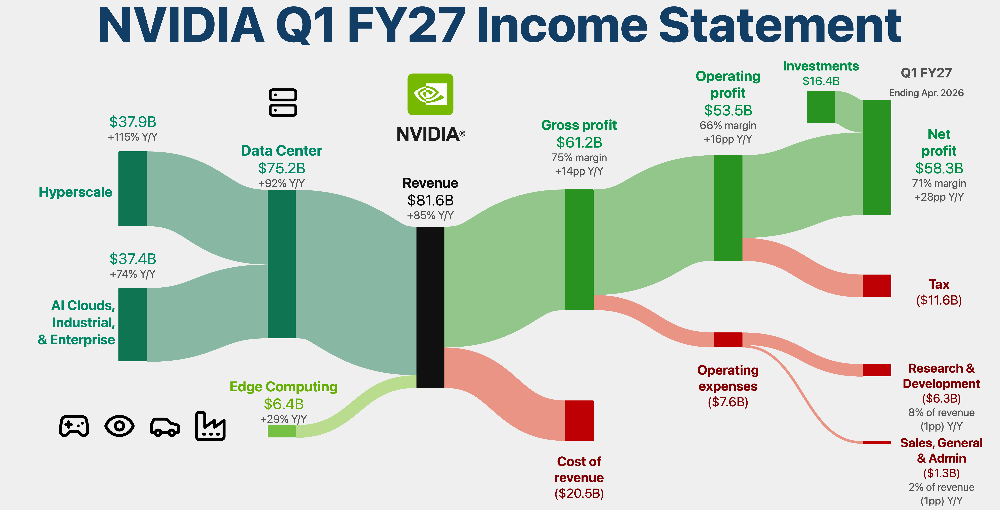

# sankey-visual-company-income-statement

A small, reusable engine that renders a company's income statement as a polished
Sankey flow diagram — in the style of the NVIDIA "Q1 FY27 Income Statement"
infographic. Green = value retained, red = costs, teal = revenue collection.

Drop in a new company's numbers and you get the same chart.



## Run it

It's a static site with no build step. Either:

```bash
# from the project root
python3 -m http.server 8000
# then open http://localhost:8000
```

…or just **double-click `index.html`** — d3 and d3-sankey are vendored locally
in `vendor/`, so it works fully offline.

Use the **Mode** switcher (d3-sankey / Reference), pick datasets from the left
Company / Data point time navigator, and **Download SVG/PNG** to export the
current chart at 2× resolution.

## Visual loop workflow

Use this workflow when a new reference image is added and the chart needs
another fidelity loop:

1. Put new, unprocessed source PNGs in `input/pending/`.
2. After processing, move the durable reference image to `input/processed/` and
   name it with the dataset key, for example `salesforce-q1-fy27.png`.
3. Set `meta.referenceImage` on the matching dataset to that processed path.
4. Install the pinned local tooling once:

   ```bash
   pnpm install --frozen-lockfile
   pnpm exec playwright install chromium
   ```

5. Run the deterministic d3 render/compare loop:

   ```bash
   pnpm verify:d3 -- <dataset-key>
   ```

The verifier starts its own static server, renders a bare d3 SVG for the
dataset, screenshots `#chart > svg`, asserts that no source image or SVG
`<image>` is present, computes pixel metrics against `meta.referenceImage`, and
cleans `compare/`. Use `pnpm verify:d3 -- <dataset-key> --keep` when you need to
inspect the candidate PNG.

`compare/` is a scratch directory. Keep incoming assets in `input/pending/` and
stable app references in `input/processed/`; do not rely on old files in
`compare/` between runs.

For a **d3-sankey fidelity loop**, the rendered output under comparison must be
the SVG produced by `SankeyEngine.render()` / d3-sankey. Do not compare against
Reference mode, a direct `` of the source PNG, or any source-image crop /
raster overlay placed into the d3 output. The source PNG is only the standard to
measure against, never part of the d3-sankey render being scored.

## Rendering modes

The app keeps two modes:

| Mode | File | Strengths | Trade-offs |
|---|---|---|---|
| **d3-sankey** (default) | `src/sankey-engine.js` | Editable data-driven SVG with custom nodes, links, labels, hover highlighting, explicit column + vertical order, fixed-layout overrides, and export. | Not pixel-identical to the hand-made reference PNG. |
| **Reference** | `meta.referenceImage` | Pixel-exact reference output for datasets with a processed PNG. | Raster-only. Datasets without `meta.referenceImage` fall back to d3-sankey. |

**Recommendation:** use Reference when a chart must match a supplied PNG
exactly; use d3-sankey for editable or new-company charts.

## Add your company

Create a file in `data/`, register it on the global `DATASETS` array, and add
one `<script>` line in `index.html`. The fastest path is the high-level helper —
you supply the line items and it derives every subtotal and flow:

```js
// data/my-company-fy25.js
(window.DATASETS = window.DATASETS || []).push(
  window.SankeyEngine.fromIncomeStatement({
    key: 'my-company-fy25',
    name: 'My Company · FY25',
    meta: { title: 'My Company FY25 Income Statement',
            period: 'FY2025', currency: '$', unit: 'M', decimals: 0 },

    revenue: [
      { label: 'Product', value: 800, notes: ['+20% Y/Y'] },
      { label: 'Services', value: 200, notes: ['+5% Y/Y'] },
    ],
    costOfRevenue: 300,
    opex: [
      { label: ['Research &', 'Development'], value: 180 },
      { label: ['Sales &', 'Marketing'],     value: 150 },
      { label: ['General &', 'Admin'],        value: 60 },
    ],
    tax: 28,
    otherIncome: [{ label: 'Interest', value: 10 }],   // optional
    derived: {
      grossProfit:     { notes: ['70% margin'] },
      operatingProfit: { notes: ['41% margin'] },
      netProfit:       { notes: ['33% margin'] },
    },
  })
);
```

```html
<!-- index.html, with the other dataset scripts -->
<script src="data/my-company-fy25.js"></script>
```

That's it. The helper computes Revenue, Gross / Operating / Net profit and wires
all the flows for you. For pixel-level control over columns, ordering, icons and
label placement, author `nodes` + `links` directly instead — see
[`data/schema.md`](data/schema.md). `data/nvidia-q1-fy27.js` is a full
hand-authored example; `data/nvidia-from-figures.js` builds the same chart from
raw figures via the helper.

## How it's built

| file                        | role                                                          |
|-----------------------------|---------------------------------------------------------------|
| `src/sankey-engine.js`      | **d3-sankey** renderer: layout + custom nodes/links/labels/logo/interactions |
| `src/income-statement.js`   | `fromIncomeStatement()` — figures → `{nodes, links}`         |
| `src/icons.js`              | Lucide icon set (inline SVG) + the NVIDIA brand glyph         |
| `data/*.js`                 | datasets (one per company/period)                             |
| `vendor/`                   | d3 v7 and d3-sankey — vendored for offline use                |
| `index.html`                | viewer shell: mode switcher + two-level dataset navigator + SVG/PNG export |

Design choices that keep every chart **aligned and consistent**:

- **Columns are explicit** (`col` per node) so the layout matches the financial
  narrative (segments → revenue → gross → operating → net) instead of whatever
  d3's auto-layering produces.
- **Colour is semantic and automatic** — node colour comes from its `type`;
  link colour is a gradient derived from its endpoints. You never pick a link
  colour by hand.
- **Labels can't collide** — side labels are de-collided in a second pass, so
  even many small terminal nodes (Tax / R&D / SG&A) stay readable.
- **Display values are preserved** — d3-sankey overwrites node values with flow
  sums, so the engine keeps the author's reported figure for the label.

## Notes

- The NVIDIA figures here are **illustrative**, matching the source infographic;
  swap in audited numbers as needed.
- Icons are [Lucide](https://lucide.dev) (MIT). The NVIDIA eye glyph is a brand
  trademark of NVIDIA Corporation, used here only to reproduce the reference;
  swap `meta.logoSvg` for your own asset.
- d3-sankey is ISC licensed and is the only charting renderer vendored here.
- Commit messages follow the project convention in
  [`docs/commit-messages.md`](docs/commit-messages.md).
